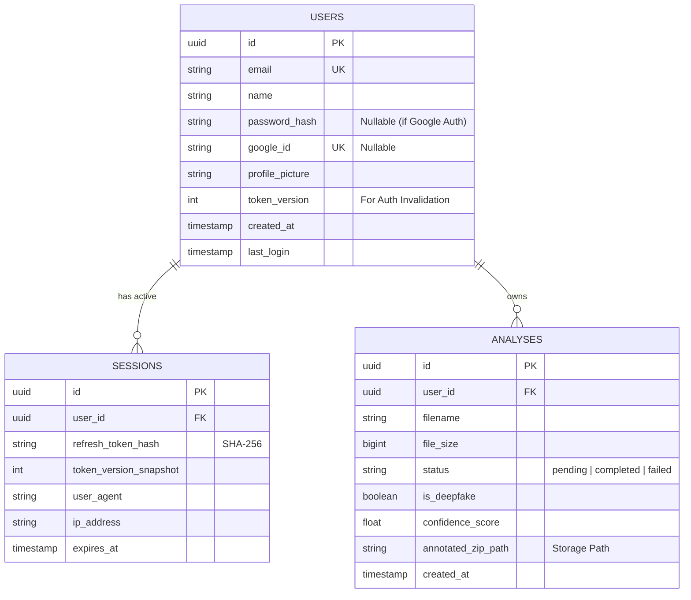
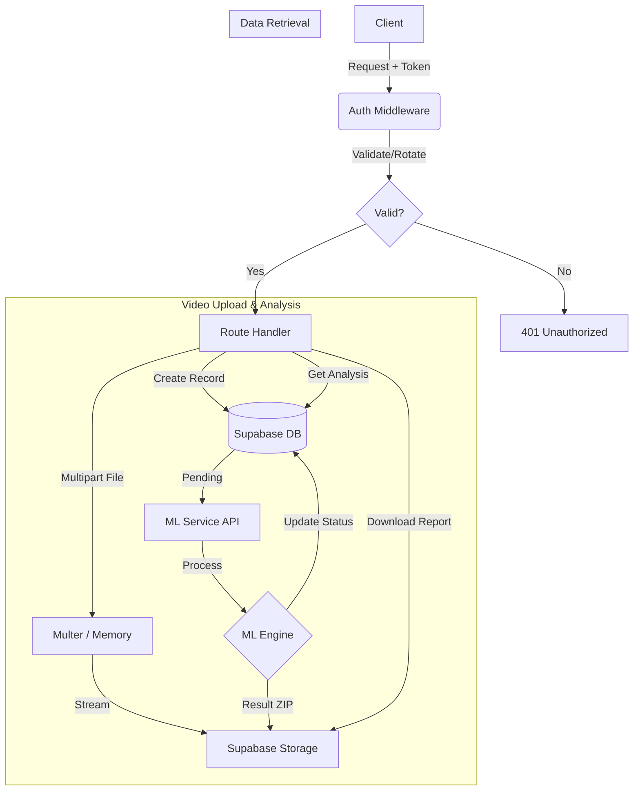

# Backend Architecture

This document provides a comprehensive overview of the backend architecture for the **Deep Guard** application. The backend is a robust REST API built with Node.js and Express, designed to handle secure authentication, large file uploads, and integration with external ML services.

## 🏗️ High-Level Overview

The backend acts as the central orchestration layer. It manages:
1.  **Authentication:** JWT-based secure session management (Access + Refresh tokens).
2.  **Data Persistence:** CRUD operations via **Supabase** (PostgreSQL).
3.  **File Storage:** Handling multipart uploads and interacting with Supabase Storage.
4.  **ML Pipelines:** Proxying media files to an external FastAPI-based ML service and processing the results.

## 🛠️ Tech Stack

| Technology | Purpose |
| :--- | :--- |
| **Node.js** | Runtime environment. |
| **Express.js** | Web framework for routing and middleware. |
| **Supabase** | Backend-as-a-Service (PostgreSQL Database + Storage). |
| **JWT (JsonWebToken)** | Stateless authentication with token rotation. |
| **Multer** | Middleware for handling `multipart/form-data` (file uploads). |
| **Axios** | HTTP client for communicating with the ML Service. |
| **AdZip** | Creation of analysis report archives. |

## 🗄️ Database Schema (ER Diagram)

The backend uses a relational model hosted on **Supabase (PostgreSQL)**.

## 📂 Directory Structure Strategy

The project follows a classic MVC-like structure for Express applications:

-   `server.js`: **Entry Point**. Sets up global middleware (CORS, Logger, Cookie Parser) and mounts routes.
-   `config/`: Configuration files (e.g., Supabase client initialization).
-   `routes/`: API route definitions.
    -   `auth.js`: Authentication endpoints (`/login`, `/refresh`, `/logout`).
    -   `analysis.js`: Core CRUD for video analysis & download logic.
    -   `analysis-image-upload.js`: Specialized logic for image batches.
    -   `ml-service.js`: Proxy routes to the Python ML backend.
    -   `trial.js` & `trial.analyze.js`: Isolated routes for the guest user system.
-   `controllers/`: Business logic handlers (separated from routes).
    -   `authController.js`: Handles user registration, login, and token generation.
    -   `analysisController.js`: Manages analysis metadata and status updates.
-   `middleware/`: Request interceptors.
    -   `auth.js`: **Critical.** Verifies JWTs, handles Refresh Token rotation, and injects `req.user`. Also handles Trial tokens.
    -   `fileupload.js`: Multer configuration for memory storage.
    -   `logger.js`: Request logging.
-   `services/`: Helper services (e.g., abstraction for Supabase Storage operations).
-   `utils/`: Shared utilities (Helpers, Encryption).

## 🔐 Authentication & Security

### 1. Token-Based Auth (JWT)
We use a **dual-token system** stored in **httpOnly cookies** to prevent XSS attacks:
-   **Access Token:** Short-lived (15 mins). Used to authorize API requests.
-   **Refresh Token:** Long-lived (30 days). Used to obtain a new Access Token.
-   **Token Rotation:** Every time a Refresh Token is used, a *new* Refresh Token is issued, and the old one is invalidated (preventing replay attacks).

### 2. Trial / Guest Authentication
-   **Stateless Approach:** Guest users do not have a database record in the `users` table.
-   **Trial Cookie:** A specific JWT (`trialAccess`) identifies the session.
-   **Resource Isolation:** Trial uploads are stored in a separate `trial_analyses` bucket and are flagged in the code to prevent access to standard user data.

### 3. Middleware Protection (`middleware/auth.js`)
-   Intercepts every protected request.
-   Checks for `accessToken`. If valid, allows.
-   If invalid/missing, checks for `refreshToken`.
-   If valid, rotates tokens (database transaction to update `sessions` table) and sets new cookies on the response.
-   Injects `req.user` into the controller context.

## � System Workflow

### Backend Request Processing

## �🔄 Core Workflows

### 1. Video Analysis Flow
1.  **Upload:** Frontend sends video to `POST /api/analysis/upload`.
2.  **Storage:** Backend streams file to Supabase Storage (`video_analyses` bucket).
3.  **Record:** Creates an entry in `analyses` table with status `pending`.
4.  **Processing:**
    -   Triggers ML Service (Async or Sync depending on implementation).
    -   ML Service processes video frame-by-frame.
    -   Results (JSON report + Annotated Images) are zipped and stored back to Supabase.
5.  **Completion:** Analysis record is updated with `is_deepfake`, `confidence_score`, and path to the generated ZIP.

### 2. Download Logic (`routes/analysis.js`)
-   Handles secure downloading of reports.
-   **Smart logic:** Determines if the requested file is a ZIP report or original media.
-   **Trial Handling:** Decodes base64 "stateless IDs" (e.g., `trial|video|...`) to fetch files without database lookups.

## 🚀 Deployment & Environment

-   **Environment Variables:** Managed via `.env` (Supabase keys, JWT secrets, ML Service URL).
-   **Keep-Alive:** A dedicated GitHub Action (`.github/workflows/keep-alive.yml`) pings the Supabase database periodcally to prevent pausing of the free-tier instance.
